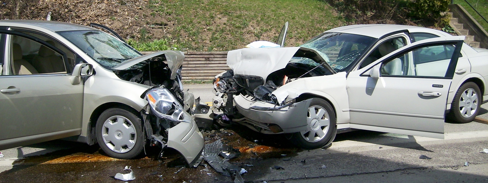

# Canada Motor Vehicle Collisions (1999 - 2017)

In many real-world data sets, class imbalance is a common problem. An imbalanced data set occurs when one class (majority or negative class) vastly outnumbered the other (minority or positive class). The class imbalance problem is manifested when the positive class is the class of interest. We have obtained a real-world dataset of motor vehicle collisions in Canada, with an inherent imbalanced class problem.

##  Dataset Information:   [National Collision Database](https://open.canada.ca/data/en/dataset/1eb9eba7-71d1-4b30-9fb1-30cbdab7e63a)

## Exploratory Data Analysis

### 1. Total Fatality By Hour
The figure below shows the fatality rate is increased at 5 p.m. on Fridays and the average age involved is around 36 years old.

### 2. Total fatality  By Vehicle Model Year
This figure below shows that the 2000 & 2001 vehicle models caused the most fatal collisions and they were driven mostly by males.

### 3. Fatality Rate By Age

This figure below shows that young male drivers caused the most fatal collision.

### 4. Fatality Rate By Month
The figure below shows the fatality rate is increased in the month of July and August, which is obviously the summer season.

## Dimensionality Reduction

##  Model Results

The result shown below is based on Random Forest Classifier

## WebApp

This project is accompanied by a web app [CollisionPredictor](https://collisionapp.herokuapp.com/)
