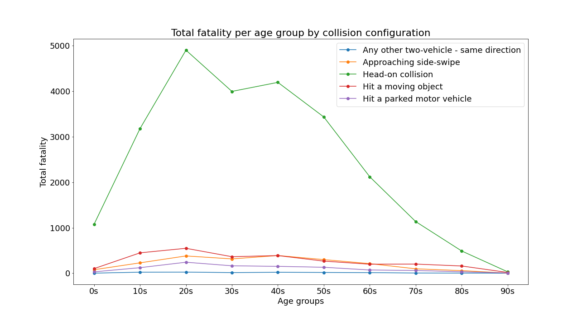

# Canada Motor Vehicle Collisions (1999 - 2017)

In many real-world datasets, class imbalance is a common problem. An imbalanced dataset occurs when one class (majority or negative class) vastly outnumbered the other (minority or positive class). The class imbalance problem is manifested when the positive class is the class of interest. We have obtained a real-world dataset of motor vehicle collisions with an inherent imbalanced class problem.

##  Dataset Information:   [National Collision Database](https://open.canada.ca/data/en/dataset/1eb9eba7-71d1-4b30-9fb1-30cbdab7e63a)

## Fatality Rate

The figures below show the total fatality and fatality rate by different variables.

This figure below shows that young people caused the most fatal collision

This figure below show that fatality rate is increased in older people

## Dimensionality Reduction

##  Model Results

The result shown below is based on Random Forest Classifier

## WebApp

This project is accompanied by a web app [CollisionPredictor](https://collisionapp.herokuapp.com/)
